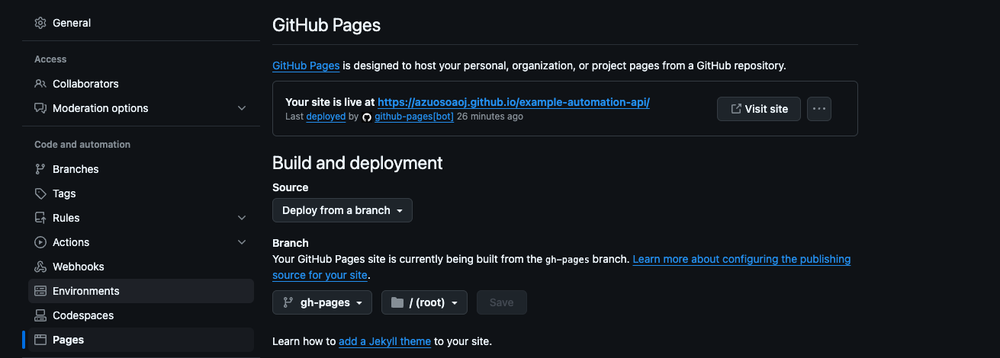

# example-automation-api

Este projeto contém testes do Playwright que podem ser executados localmente ou através do GitHub Actions. Os testes estão configurados para gerar relatórios Allure, facilitando o acompanhamento dos resultados.

## Executando localmente

### Pré-requisitos

Antes de executar os testes localmente, certifique-se de ter os seguintes itens instalados:

- [Node.js](https://nodejs.org/) (versão 16 ou superior)
- [npm](https://www.npmjs.com/)
- [Playwright](https://playwright.dev/) (instalado como parte do projeto)
- [Allure CLI](https://github.com/allure-framework/allure2)

### Passo a passo de como executar localmente

1. **Clone o repositório:**

   ```bash
   git clone https://github.com/seunome/exemplo-automacao-api.git
   cd exemplo-automacao-api
   ```

2. **Instale as dependências:**

   ```bash
   npm install
   ```

3. **Instale as dependências do Playwright:**

   ```bash
   npx playwright install-deps
   ```

4. **Execute os testes do Playwright:**

   ```bash
   npx playwright test --reporter=allure-playwright --output=allure-results
   ```

5. **Gere o relatório do Allure:**

   ```bash
   allure serve allure-results
   ```

---

## Executando via GitHub Actions

Para rodar os testes via GitHub Actions, siga os passos abaixo:

### 1. Fazer um Fork ou Solicitar Acesso

Existem duas formas de executar os testes:

- **Fazer um Fork**: Você pode fazer um fork do repositório e rodar os testes no seu próprio repositório. Para fazer o fork, clique no botão **Fork** no canto superior direito da página do repositório no GitHub.
- **Solicitar Acesso**: Caso não queira fazer um fork, você pode solicitar acesso ao mantenedor do repositório para liberar os acessos necessários.

### 2. Configurações Importantes no Fork

Se você fez um **fork** do repositório, é importante configurar algumas permissões no seu repositório para que o GitHub Actions funcione corretamente:

- **Permitir leitura e escrita do GitHub Token**: O GitHub Actions usa o token de autenticação para acessar o repositório e publicar os resultados. Para garantir que o token funcione corretamente, siga os passos abaixo:

  1. Acesse seu repositório no GitHub.
  2. Vá em **Settings > Actions > General**.
  3. No campo **Workflow permissions**, selecione a opção **Read and write permissions**.

   Mais informações podem ser encontradas [aqui](https://docs.github.com/pt/actions/security-for-github-actions/security-guides/automatic-token-authentication#modifying-the-permissions-for-the-github_token).

- **Deploy da página do relatório via Allure**: O relatório é fornecido via Allure utilizando GitHub Pages. Após executar o workflow, configure o apontamento de deploy para a branch `gh-pages`, como mostrado na imagem abaixo:

   

### 3. Acionando os testes

1. Acesse a aba **Actions** no seu repositório no GitHub.
2. Encontre e selecione o workflow **Run Playwright Tests**.
3. Clique no botão **Run workflow**.
4. Selecione a branch `main`.
5. Clique em **Run workflow** para iniciar a execução dos testes.

### 4. Acompanhe a Execução e Acesse o Relatório

- O GitHub Actions começará a executar os testes e o progresso será exibido em tempo real na interface do GitHub.
- Quando a execução terminar, você poderá acessar o relatório gerado no step `Acess Report URL`.
